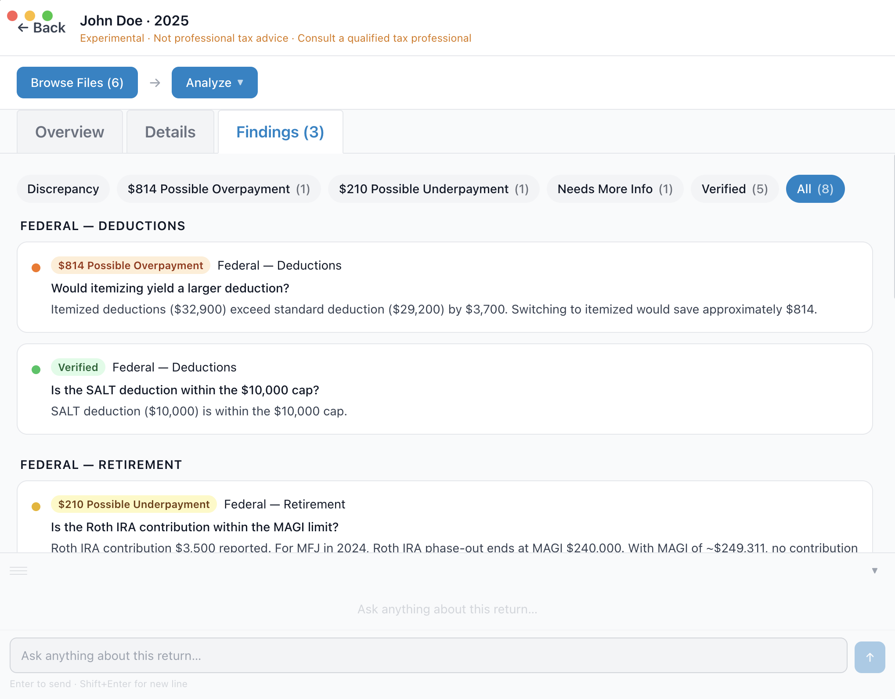

# Tax Checker

Built this app after spending a lot of time on LLMs trying to get my tax filed correctly. It takes IRS forms and supporting documents to extract key figures and surface potentially missed deductions, credits, and filing issues.

**Note:** This is an experimental software. It will get things wrong. The tax checks are neither exhaustive nor guaranteed to be accurate. In addition, LLMs make mistakes. Do not rely on any output from this app for filing decisions. Always consult a qualified tax professional before making any tax decisions.

## Security

Documents stay on your machine. Files are sent only to the AI provider's API (Anthropic, Google, or OpenAI) when you run an analysis. API keys are entered at runtime and are never written to disk. Check the provider's data policy. Some of them say they don't use your data to train their models. If you're concerned, consider using anonymization tools. The app converts pdf files to text before sending it to LLMs. One improvement of the software could be to add anonymization step.


## Features

- **PDF to text** — converts PDF files to plain text locally using [pdf-parse](https://github.com/modesty/pdf-parse) before sending anything to a model, reducing token usage and keeping raw documents off the wire where possible.
- **Extract** — parses uploaded tax documents and pulls out structured data: income, deductions, credits, refund/owed, effective rate, filing status, dependents, and attached schedules.
- **Check** — evaluates the return against a checklist of federal and state tax opportunities and flags anything that may have been missed or miscalculated.
- **Chat** — ask follow-up questions about the return; the model has full context of the uploaded documents.
- **Sessions** — all sessions are saved locally. Each session stores uploaded files, extracted data, and check results for future reference.




## Setup

Requirements: Node.js 18+

```bash
git clone <repo>
cd tax-checker
npm install
npm run dev
```

The app window opens automatically. No API key is required until you run an analysis.


## Supported Models

| Provider | Label | Integration Tested? | Notes |
|----------|-------|---------------------|-------|
| Anthropic | Claude | Yes | Default and recommended. Uses `claude-sonnet-4-6`. |
| Google | Gemini | No | May work but has not been validated end-to-end. |
| OpenAI | Codex | No | May work but has not been validated end-to-end. |
| — | Mock LLM | Should always work | Replays canned sample data. No API key required. Useful for testing the UI. |

To run without any API key, select **Mock LLM** from the Analyze menu.

### Changing the Claude model

The default Claude model used for extraction is `claude-sonnet-4-6`. To change it, edit the model field when creating a new session, or update the default in `src/config.js`:

```js
export const DEFAULT_MODEL = 'claude-sonnet-4-6'
```

The checks step always uses `claude-sonnet-4-6` regardless of session model setting.


## How to Use

1. **Create a session** — click `+ New Session`, enter the taxpayer name and tax year.
2. **Browse Files** — click `Browse Files` to add tax documents. Supported formats: PDF (1040, schedules, W-2, 1099s, etc.), images (PNG, JPG), Excel (.xlsx), and CSV/TXT.
3. **Analyze** — click `Analyze` and select a model. Enter your API key when prompted (not required for Mock LLM). The model extracts key figures and runs the tax opportunity checks in sequence.
4. **Review results** — the Overview tab shows extracted figures; the Findings tab shows check results grouped by category.
5. **Ask questions** — type in the chat panel to ask anything about the return.


## Dry Run Mode

For UI development and testing without making live API calls:

| Variable | Effect |
|----------|--------|
| `DRY_RUN=true` | Skips all API calls and replays data from `~/TaxChecker/sample.json`. |
| `SAVE_SAMPLE=true` | Shows a **Save as sample** button in the session action bar. After running a full analysis, click it to save the session data to `~/TaxChecker/sample.json` for use with `DRY_RUN`. |

```bash
SAVE_SAMPLE=true npm run dev   # run a real analysis and save it as the sample
DRY_RUN=true npm run dev       # replay the saved sample — no API calls made
```


## Tax Checks

Tax opportunity checks are defined in `tax-checks.md` at the project root. Each check has the form:

```
IF <condition derived from extracted return data>
THEN <question to verify>
Rule: <evaluation logic and outcome codes>
```

The checks cover some federal and state rules.

**Limitations:**
- The checks are not exhaustive. Many valid issues will not be flagged.
- Check logic is evaluated by a language model, which can get things wrong.
- Tax law changes frequently. Some checks may be outdated or wrong.
- All findings should be independently verified against current IRS guidance.

To add a new check, append it to the relevant section in `tax-checks.md`.


## File Processing

Before sending files to the model, the app pre-processes them to reduce token usage:

| File type | Treatment | Sent to model as |
|-----------|-----------|-----------------|
| PDF (text-based) | Text extracted, saved as `*-auto-generated.txt` | Plain text |
| PDF (scanned/image) | Detected automatically | Base64 document |
| Excel (.xlsx, .xls) | Converted to CSV | Plain text |
| Image (PNG, JPG, etc.) | Passed as-is | Base64 image |
| CSV / TXT | Passed as-is | Plain text |


## Data Storage

Sessions are saved to `<project>/sessions/`. Each session folder contains:

```
{taxpayer}-{year}-{timestamp}/
  session.json          # metadata, extracted data, and check results
  input/                # copies of uploaded documents
  claude-logs/          # full request/response logs for every API call
```

A built-in John Doe session (`sessions/john-doe-2024/`) is included with sample IRS forms and is pre-loaded on first launch. It cannot be deleted but its analysis can be cleared and re-run.


## Building for Distribution

```bash
npm run build:mac    # macOS — produces .dmg
npm run build:win    # Windows — produces .exe installer
npm run build:linux  # Linux — produces .AppImage
```


## Stack

- [Electron](https://electronjs.org)
- [electron-vite](https://electron-vite.org)
- [React](https://react.dev)
- [Tailwind CSS](https://tailwindcss.com)
- [@anthropic-ai/sdk](https://github.com/anthropics/anthropic-sdk-typescript)
- [@google/generative-ai](https://github.com/google-gemini/generative-ai-js)
- [openai](https://github.com/openai/openai-node)
